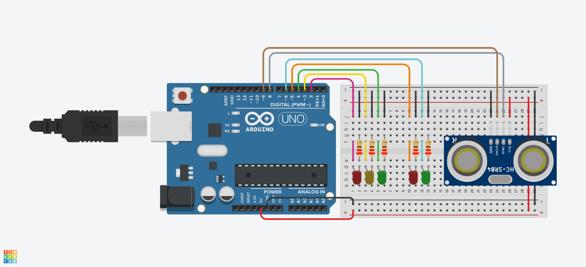

# semaforo-ino
Um sistema de semáforo feito para a matéria de Robótica do Ensino Médio

## Circuito em Protoboard

### Componentes Eletrônicos

| Componente                 | Qnt |
| -------------------------- |:---:|
| Placa Arduino              |  1  |
| LED Vermelho               |  2  |
| LED Amarelo                |  1  |
| LED Verde                  |  2  |
| Resistor de 220 Ω          |  5  |
| Sensor Ultrassônico HCSR04 |  1  |